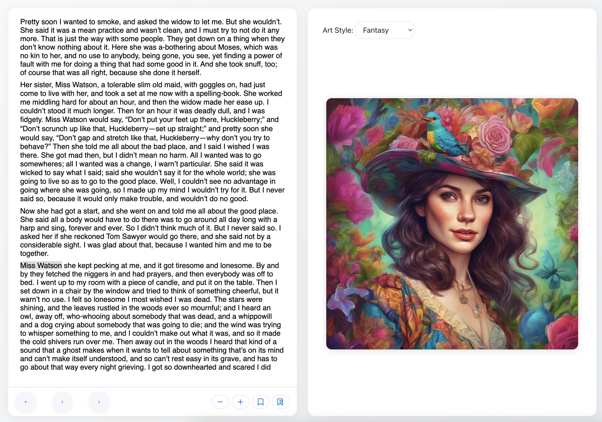

# Sova – your AI reading companion. (Sova means Owl.)

A modern web application for reading EPUB books and generating AI illustrations with seamless integration.

## Features
- **EPUB Reader**: Upload and read EPUB books with bookmarks, navigation, and font controls.
- **AI Image Generation**: Summarize the current page or selected text and generate illustrations using Cloudflare Workers AI.
- **Art Style Selection**: Choose from multiple AI art styles (Cyberpunk, Fantasy, Futuristic, Abstract, Retro Wave, Sci-Fi, Custom) — your choice is persistent and always used for new images.

## AI Models Used

- **Image Generation:** [Stable Diffusion XL](https://developers.cloudflare.com/workers-ai/models/image-generation/stable-diffusion-xl/) (via Cloudflare Workers AI)
- **Text Summarization:**
  - **Primary:** [AI Summary Agent](https://ai.io.net/ai/agents) (multilanguages)
  - **Fallback:** [Facebook BART](https://developers.cloudflare.com/workers-ai/models/bart-large-cnn/) (via Cloudflare Workers AI)

> The app uses the AI agent API for text summarization by default. If that service is unavailable (limit), it automatically falls back to Cloudflare Workers AI (BART model). Image generation always uses Cloudflare Workers AI (Stable Diffusion XL). You can swap models or endpoints in the code as needed.

## Screenshot




## Local Development

Follow these steps to set up Sova locally:

1. **Clone the repository**
   ```bash
   git clone https://github.com/alekcangp/sova.git
   cd sova
   ```

2. **Install dependencies**
   ```bash
   npm install
   ```

3. **Set up environment variables**
   - Copy `.env.example` to `.env`
   - Fill in your Cloudflare Workers AI credentials:
     - `CLOUDFLARE_ACCOUNT_ID`
     - `CLOUDFLARE_API_TOKEN`
   - (Optional) Set up io.net API key if using their services

4. **Start the development server**
   ```bash
   npm run dev
   ```
   The app will be available at `http://localhost:5173`

5. **Build for production**
   ```bash
   npm run build
   npm run preview
   ```

## Deployment

- Click the button below to deploy your own instance to Vercel with one click:

  [](https://vercel.com/import/project?template=https://github.com/alekcangp/sova)

- Ensure all environment variables are set in the Vercel dashboard (case-sensitive). See `.env.example` for required variables.


## License

MIT
